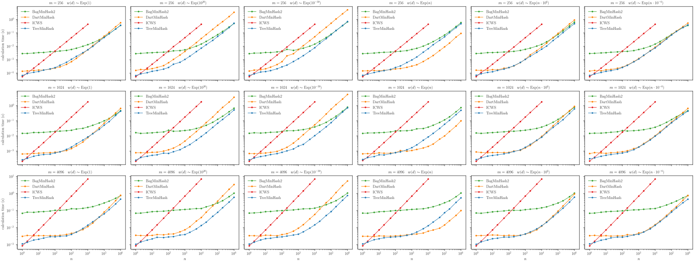

# TreeMinHash: Fast Sketching for Weighted Jaccard Similarity Estimation

TreeMinHash is a sketching algorithm for weighted sets. It is able to compute signatures that can be used for [weighted Jaccard similarity](https://en.wikipedia.org/wiki/Jaccard_index#Weighted_Jaccard_similarity_and_distance) estimation and [locality-sensitive hashing](https://en.wikipedia.org/wiki/Locality-sensitive_hashing). The algorithm requires multiple passes over the data and its time complexity is O(n + m log m) where n denotes the size of the weighted set (the number of elements with weight > 0) and m denotes the signature size (sketch size). 

TreeMinHash combines several ideas of recently proposed algorithms. It uses a tree-like splitting of the weight domain as proposed by BagMinHash. Compared to TreeMinHash it uses a coarser weight discretization. To incorporate the values of the weights exactly, it uses rejection sampling as recently proposed by DartMinHash [2]. Furthermore, similar to DartMinHash, TreeMinHash estimates the stop limit in a first pass. In contrast, BagMinHash must update the stop limit permanently. We also use sampling without replacement for the selection of signature components as was already done before by SuperMinHash [3] and ProbMinHash [4].

The slides of a recent presentation which also covered the basic ideas of TreeMinHash can be found on [SlideShare](https://www.slideshare.net/OtmarErtl/speeding-up-minwise-hashing-for-weighted-sets-239311360).

## Results

We compared the performance of BagMinHash2 [1], DartMinHash [2], improved consistent weighted sampling (ICWS) [5], and TreeMinHash. The test setup was essentially the same as described in [4]. 


The performance results below show that the calculation time of TreeMinHash is independent of the weight sum, unlike DartMinHash. Furthermore, TreeMinHash is always faster for very small input.



For verification we used synthetically generated weighted sets for which the weighted Jaccard similarity can be calculated in advance as described in [4]. The results below show that the relative empirical MSE for all tested algorithms is within the expected (gray) range.


## Steps to Reproduce the Results and Figures on Windows 11
1. Install Windows Subsystem for Linux (WSL) with [Ubuntu 22.04.1 LTS](https://apps.microsoft.com/store/detail/ubuntu-22041-lts/9PN20MSR04DW)

2. Install required packages:
   ```
   sudo apt install gradle g++ libboost-dev python3-matplotlib python3-scipy texlive-full make
   ```
3. Clone repository including submodules:
   ```
   git clone --recursive https://github.com/oertl/treeminhash.git
   ```
4. Download and compile [xxHash](https://github.com/Cyan4973/xxHash) as needed by BagMinHash:
   ```
   cd treeminhash/bagminhash/c++/xxhash
   wget https://github.com/Cyan4973/xxHash/archive/v0.8.1.zip
   unzip v0.8.1.zip
   cd xxHash-0.8.1
   make lib
   cp libxxhash.a ..
   cp xxhash.h ..
   cd ../../../..
   ```
5. Run simulations in `treeminhash` directory (takes several hours):
   ```
   gradle execute
   ```
6. Generate figures:
   ```
   gradle figures
   ```

## Sketches for Inner Product Estimation
It has been proposed to use weighted minwise hashing to create sketches for vectors that can be used for inner product estimation [6]. [inner_product_test.cpp](c++/inner_product_test.cpp) demonstrates how TreeMinHash can be combined with their ideas. The result is a cleaner and probably faster algorithm, since discretization of the input vectors is not required as in the original approach.

## References

[1] Ertl, O. (2018). Bagminhash-minwise hashing algorithm for weighted sets. In Proceedings of the 24th ACM SIGKDD International Conference on Knowledge Discovery & Data Mining (pp. 1368-1377). 
[[paper]](https://arxiv.org/abs/1802.03914) [[GitHub]](https://github.com/oertl/bagminhash)

[2] Christiani, T. (2020). DartMinHash: Fast Sketching for Weighted Sets. arXiv preprint arXiv:2005.11547. 
[[paper]](https://arxiv.org/abs/2005.11547) [[GitHub]](https://github.com/tobc/dartminhash)

[3] Ertl, O. (2017). Superminhash-A new minwise hashing algorithm for jaccard similarity estimation. arXiv preprint arXiv:1706.05698. [[paper]](https://arxiv.org/abs/1706.05698)

[4] Ertl, O. (2019). ProbMinHash--A Class of Locality-Sensitive Hash Algorithms for the (Probability) Jaccard Similarity. arXiv preprint arXiv:1911.00675. [[paper]](https://arxiv.org/abs/1911.00675) [[GitHub]](https://github.com/oertl/probminhash) 

[5] Ioffe, S. (2010). Improved consistent sampling, weighted minhash and l1 sketching. In 2010 IEEE International Conference on Data Mining (pp. 246-255). [[paper]](https://research.google/pubs/pub36928.pdf)

[6] Bessa, A., et al. (2023). Weighted Minwise Hashing Beats Linear Sketching for Inner Product Estimation. arXiv preprint arXiv:2301.05811. [[paper]](https://arxiv.org/abs/2301.05811)
